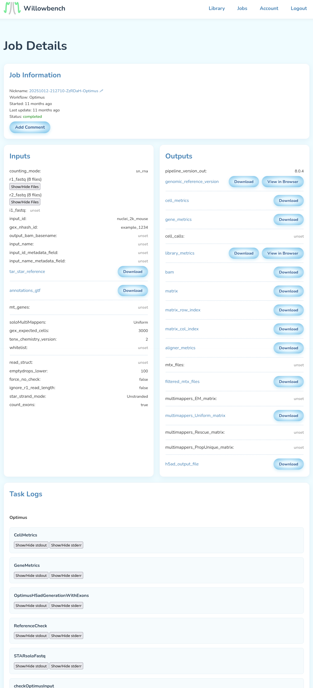

A final frozen snapshot of the workflow runner platform I was building (initially targeting running WDL workflows on AWS, with computational biology as the intended market) during 2025. It works, although I never got as far as scaling it up - in particular, tasks are just run on EC2 instances.

The "Widdler" is the most interesting part; it is a working implementation of WDL, completely decoupled from actual execution. It takes instructions on jobs to start, and reports of tasks (i.e. job steps) completing/failing. It returns instructions on tasks to start, and reports of overall jobs completing/failing. It does its job by tracking the AST of the currently active job, resolving variables to actual values (or S3 filepaths) when available, and instructing a task to be launched when all of its inputs are available.

Maybe this will somehow be useful to someone at some point; that would be nice!

A screenshot of the platform in action, viewing a finished run of the [Optimus pipeline](https://broadinstitute.github.io/warp/docs/Pipelines/Optimus_Pipeline/README):

